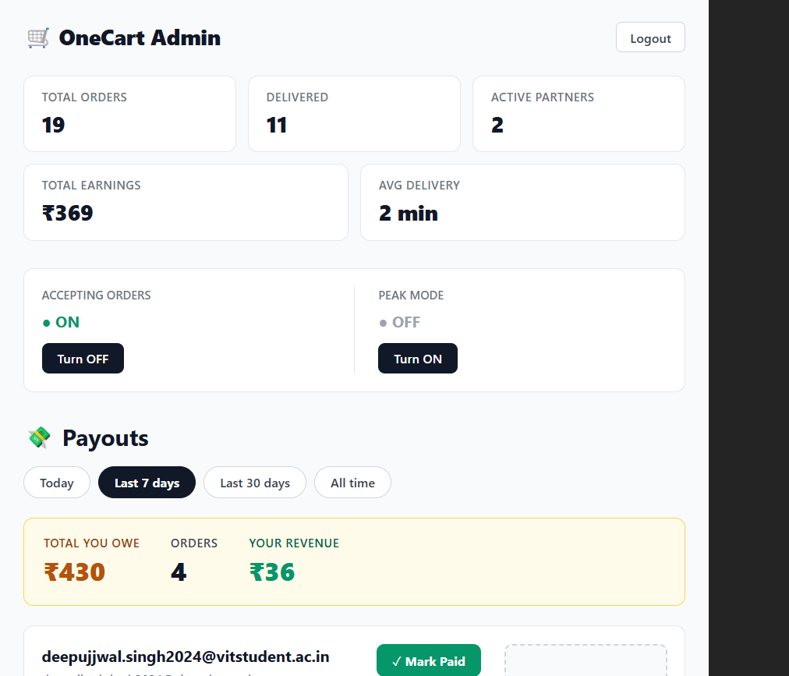
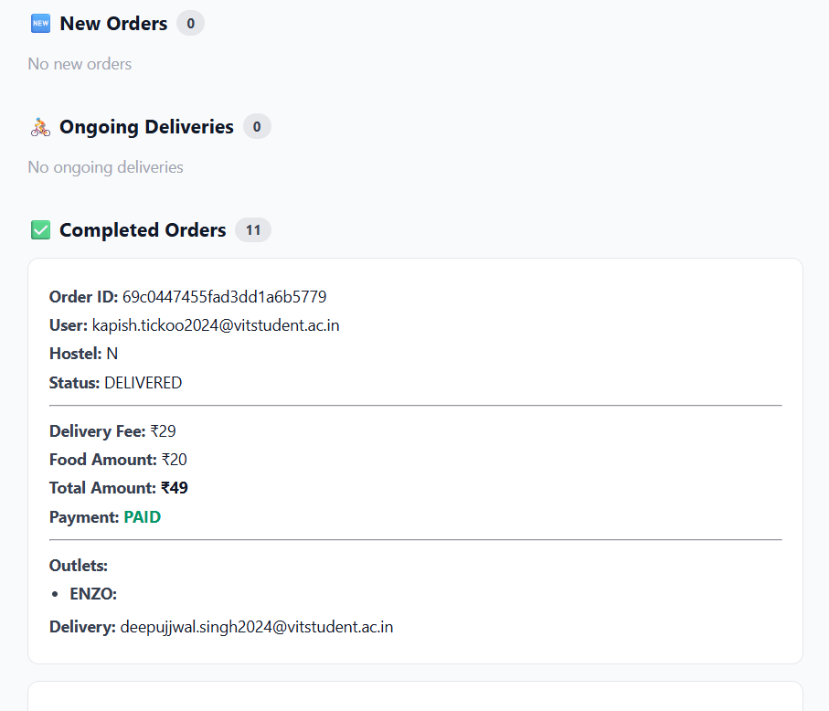
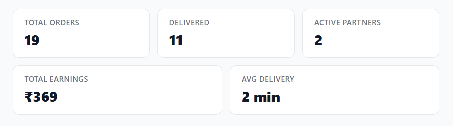

<div align="center">


# OneCart

### Multi-outlet campus food delivery — order from two canteens in one checkout.

[](https://expo.dev)
[](https://nodejs.org)
[](https://mongodb.com)
[](https://razorpay.com)
[]()

**10 delivery partners · 10 active users · 30+ real orders · ₹2000+ revenue**

</div>

---

## The Problem

Campus food apps at VIT make you place **separate orders for separate outlets** — meaning separate payments, separate waits, separate tracking. If you want food from Juice Corner *and* the main canteen, you're doing it twice.

**OneCart collapses that into one flow.** Pick from multiple outlets, pay once, track one order, one delivery partner brings everything.

---

## What Was Built

Four separate apps, one backend, one database.

```
onecart-backend      → Node.js + Express + MongoDB Atlas (the brain)
onecart-user-app     → React Native (Expo) — what customers use
onecart-delivery     → React Native (Expo) — what delivery partners use
onecart-admin        → Vite React — what I use to manage everything
```

No app talks to another app directly. Every piece of data lives in MongoDB. The frontend apps are just screens that read from and write to the backend.

---

## Screenshots

### User App

| Home | Menu & Order | Order Tracking | Arrived Notification |
|------|-------------|----------------|----------------------|
|  |  |  |  |

> 📸 *Add your screenshots to a `/screenshots` folder in this repo*

### Delivery App

| Available Orders | Assigned Order | Mark Arrived | Mark Delivered |
|-----------------|----------------|--------------|----------------|
|  |  |  |  |

### Admin Panel

| Dashboard | Orders | Analytics |
|-----------|--------|-----------|
|  |  |  |

---

## Architecture

```
┌─────────────────┐    ┌─────────────────┐    ┌─────────────────┐
│   User App      │    │  Delivery App   │    │   Admin Panel   │
│  (React Native) │    │  (React Native) │    │  (Vite React)   │
└────────┬────────┘    └────────┬────────┘    └────────┬────────┘
         │                      │                       │
         │         HTTP REST API (all routes)           │
         │                      │                       │
         └──────────────────────┼───────────────────────┘
                                │
                    ┌───────────▼────────────┐
                    │    onecart-backend     │
                    │  Node.js + Express     │
                    │                        │
                    │  /auth   /orders       │
                    │  /delivery  /payment   │
                    │  /system  /admin       │
                    └───────────┬────────────┘
                                │
                    ┌───────────▼────────────┐
                    │    MongoDB Atlas        │
                    │                        │
                    │  Users · Orders        │
                    │  Outlets · SystemConfig│
                    └────────────────────────┘
```

---

## Order Lifecycle

Every order flows through these states:

```
CREATED → ASSIGNED → ARRIVED → DELIVERED
                  ↘          ↗
                  CANCELLED
```

| State | Trigger | Who |
|-------|---------|-----|
| `CREATED` | User places & pays for order | User app |
| `ASSIGNED` | Delivery partner accepts | Delivery app |
| `ARRIVED` | Delivery partner marks arrival at hostel | Delivery app |
| `DELIVERED` | Delivery partner confirms handoff | Delivery app |
| `CANCELLED` | User cancels / no partner accepts in 5min | Either |

> When a delivery partner marks **ARRIVED**, the user gets a **push notification** with a note ("I'm at the gate of Block B"). An amber banner appears on their tracking screen.

---

## Tech Stack

### Backend
- **Node.js + Express** — REST API server
- **MongoDB + Mongoose** — data persistence (hosted on Atlas)
- **Expo Push Notifications** — push to both user and delivery partner apps
- **Razorpay** — payment processing with HMAC-SHA256 signature verification
- **Brevo** — transactional OTP emails (migrated from Gmail SMTP + Resend due to sandbox/timeout issues on Render)
- **Render** — backend deployment

### Mobile Apps
- **React Native + Expo** — cross-platform mobile development
- **expo-notifications + Firebase** — push notification delivery
- **AsyncStorage** — local auth persistence
- **Razorpay React Native SDK** — in-app payment sheet

### Admin Panel
- **Vite + React** — single-page admin dashboard
- **Client-side auth** — SHA-256 hashed password comparison

---

## Key Features

**For users**
- OTP-based login (restricted to `@vitstudent.ac.in` emails)
- Browse and order from up to 2 outlets in one checkout
- Razorpay payment integration
- Real-time order tracking with 5-second polling
- Push notification when delivery partner arrives with a note

**For delivery partners**
- See available orders, accept in one tap
- Set food amount after picking up from outlet
- Mark arrived with a custom note to the user
- Earnings tracked per delivery

**For admins**
- Toggle order acceptance on/off instantly
- Enable peak mode (adds ₹10 to delivery fee)
- View all live orders
- Analytics: orders per day, delivery performance, revenue summary

---

## Delivery Fee Pricing

| Items | Single Outlet | Two Outlets |
|-------|--------------|-------------|
| 1–2 items | ₹29 | ₹39 |
| 3–4 items | ₹39 | ₹49 |
| 5+ items | ₹49 | ₹59 |

Peak mode adds ₹10 to all tiers. Toggled from the admin panel.

---

## Data Models

**User** — polymorphic, single collection for all roles
```js
{ name, email, hostelBlock, role: "user"|"delivery"|"admin",
  otp, otpExpiry, isApproved, isAvailable, pushToken, totalEarnings }
```

**Order**
```js
{ user, outlets[], hostelBlock, status, deliveryPerson,
  deliveryFee, foodAmount, totalAmount, paymentStatus,
  arrivalNote, deliveredAt }
```

**Outlet**
```js
{ name, menuImages[], instructions }
```

**SystemConfig** — single document
```js
{ acceptingOrders: Boolean, peakMode: Boolean }
```

---

## Auth Flow

1. User enters `@vitstudent.ac.in` email
2. Backend sends 6-digit OTP via Brevo transactional email
3. User submits OTP → backend verifies and returns user object
4. User object stored in `AsyncStorage` — no JWT, no session expiry
5. Email passed in every subsequent request for identity

---

## Running Locally

### Backend
```bash
cd onecart-backend
npm install
# Create .env with MONGO_URI, RAZORPAY_KEY_ID, RAZORPAY_KEY_SECRET,
#   BREVO_API_KEY, SENDER_EMAIL
npm start
```

### User App
```bash
cd onecart-user-app
npm install
# Add google-services.json to project root (Firebase config)
npx expo run:android
```

### Delivery App
```bash
cd onecart-delivery
npm install
npx expo run:android
```

### Admin Panel
```bash
cd onecart-admin
npm install
# Set VITE_ADMIN_HASH in .env (SHA-256 hash of admin password)
npm run dev
```

---

## Environment Variables

### Backend (`.env`)
```
MONGO_URI=
RAZORPAY_KEY_ID=
RAZORPAY_KEY_SECRET=
BREVO_API_KEY=
SENDER_EMAIL=
PORT=5000
```

### Admin Panel (`.env`)
```
VITE_ADMIN_HASH=   # SHA-256 of admin password
```

---

## Real Challenges Solved

**Push notifications on Android** — Getting expo-notifications to initialize Firebase correctly required the `expo-notifications` plugin in `app.json`, a `google-services.json` at the project root, and a full native rebuild. Hours of `metadata.bin` corruption errors and Gradle daemon lock issues on Windows.

**Delivery cancellation race condition** — When a delivery partner cancelled an assigned order, the user app still showed it as assigned because local state was cleared before confirming the server response. Fixed by only clearing state after a confirmed 200.

**Email provider migration** — Gmail SMTP hit timeouts on Render's free tier. Resend had sandbox restrictions. Migrated to Brevo's API-based transactional email which worked reliably in production.

**Windows path length limit** — `node_modules` nesting in React Native projects exceeds Windows' 260-character path limit. Resolved with `\\?\` long path prefix and enabling long paths in Windows registry.

**Atomic order acceptance** — Multiple delivery partners could theoretically accept the same order simultaneously. Used MongoDB's `findOneAndUpdate` with a status condition to make acceptance atomic — only one partner wins.

---

## What's Next

- [ ] WebSockets to replace polling (reduce server load)
- [ ] JWT-based authentication with session expiry
- [ ] Expand to 3+ outlets
- [ ] In-app chat between user and delivery partner
- [ ] Delivery partner earnings dashboard
- [ ] EAS Build for production APK distribution

---

## Built By

**Kapish** — B.Tech CSE, VIT University (2nd year)

Built, validated, and shipped as a solo project. Validated the idea before writing code, iterated based on real user feedback, debugged real production issues.

> *"The best way to learn systems is to build one that real people depend on."*

---

<div align="center">

**Backend deployed on [Render](https://render.com) · Database on [MongoDB Atlas](https://mongodb.com/atlas)**

</div>
